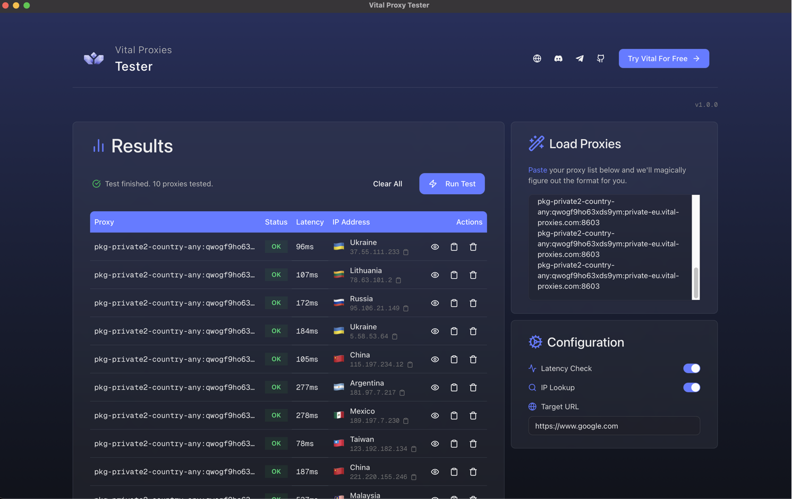

<div align="center">
  <!-- For images to show up on GitHub, commit them to a .github/assets folder -->
  
  <h1 align="center">Vital Proxy Tester</h1>
  <p align="center">
    A modern, open-source desktop application for testing and validating proxy lists with real-time results.
  </p>
</div>

<p align="center">
  <a href="https://github.com/vital-proxies/proxy-tester/releases/latest">
    
  </a>
</p>

<p align="center">
  <a href="#installation">Installation Guide</a>
  ·
  <a href="https://github.com/vital-proxies/proxy-tester/issues">Report a Bug</a>
  ·
  <a href="https://github.com/vital-proxies/proxy-tester/issues">Request a Feature</a>
</p>

---



---

## 📦 About The Project

The Vital Proxy Tester is a powerful yet simple tool built for anyone who works with proxies. Developed with a modern tech stack (Next.js, Tauri, and Zustand), it provides a fast, beautiful, and intuitive cross-platform experience.

No more slow or clunky testing tools. Get instant feedback with a detailed, real-time analysis for each proxy in your list.

### Key Features

- 🚀 **High-Performance Testing:** Asynchronously tests proxies with a configurable concurrency limit to get results fast.
- 🌍 **Comprehensive Data:** For each successful proxy, view Status, Latency (TTFB), IP Address, Country, City, and ISP.
- ✨ **Smart & Interactive UI:**
  - **Auto-Parsing:** Paste your list in almost any common format (`host:port:user:pass`, `user:pass@host:port`, etc.).
  - **Easy Actions:** Copy proxy strings/IPs, view detailed breakdowns, and manage your results with a single click.
- 🔄 **Automatic Updates:** The app notifies you when a new version is available, so you're always up-to-date.
- 💻 **Cross-Platform:** Works seamlessly on macOS, Windows, and Linux.

---

## 💾 Installation & Usage

Find your operating system in the table below and click the direct download link.

_(Note: The version numbers in the filenames update with each new release. These links always point to the latest version.)_

| Platform       | Architecture    | File Type   | Download Link                                                                                                                 | Notes                         |
| :------------- | :-------------- | :---------- | :---------------------------------------------------------------------------------------------------------------------------- | :---------------------------- |
| 🪟 **Windows** | 64-bit (x64)    | `.exe`      | [**Download**](https://github.com/vital-proxies/proxy-tester/releases/download/1.0.0/Vital.Proxy.Tester_1.0.0_x64-setup.exe)  | Easiest option, auto-installs |
| 🪟 **Windows** | 64-bit (x64)    | `.msi`      | [**Download**](https://github.com/vital-proxies/proxy-tester/releases/download/1.0.0/Vital.Proxy.Tester_1.0.0_x64_en-US.msi)  | Alternate installer           |
| 🍎 **macOS**   | Apple Silicon   | `.dmg`      | [**Download**](https://github.com/vital-proxies/proxy-tester/releases/download/1.0.0/Vital.Proxy.Tester_1.0.0_aarch64.dmg)    | M1/M2/M3 Macs                 |
| 🍎 **macOS**   | Intel           | `.dmg`      | [**Download**](https://github.com/vital-proxies/proxy-tester/releases/download/1.0.0/Vital.Proxy.Tester_1.0.0_x64.dmg)        | Most Intel Macs               |
| 🐧 **Linux**   | Universal (x64) | `.AppImage` | [**Download**](https://github.com/vital-proxies/proxy-tester/releases/download/1.0.0/Vital.Proxy.Tester_1.0.0_amd64.AppImage) | Works on most modern distros  |
| 🐧 **Linux**   | Debian-based    | `.deb`      | [**Download**](https://github.com/vital-proxies/proxy-tester/releases/download/1.0.0/Vital.Proxy.Tester_1.0.0_amd64.deb)      | Ubuntu/Debian systems         |
| 🐧 **Linux**   | RHEL-based      | `.rpm`      | [**Download**](https://github.com/vital-proxies/proxy-tester/releases/download/1.0.0/Vital.Proxy.Tester-1.0.0-1.x86_64.rpm)   | Fedora/RHEL/CentOS            |

> **Important Note for macOS Users:**
> The first time you run the app, you will need to **right-click** the application icon and select **"Open"** from the context menu. In the security prompt that appears, click **"Open"** again. You only need to do this once.

Once installed, simply paste your proxy list, configure your options, and click "Run Test"!

---

## 💻 Development & Contribution

We welcome contributions from the community! Whether it's a bug fix, a new feature, or a documentation improvement, your help is appreciated!

### Prerequisites

To get the development environment running, you'll need the following installed:

- [**Node.js**](https://nodejs.org/) (v20 or higher)
- [**Yarn**](https://yarnpkg.com/)
- [**Rust**](https://www.rust-lang.org/) and Cargo
- [**Tauri Prerequisites**](https://tauri.app/v1/guides/getting-started/prerequisites) for your specific OS.

### Local Development Setup

1.  **Clone the repository:**
    ```sh
    git clone https://github.com/vital-proxies/proxy-tester.git
    cd proxy-tester
    ```
2.  **Install dependencies:**
    ```sh
    yarn install
    ```
3.  **Run the development server:**
    ```sh
    yarn tauri dev
    ```

### How to Contribute

We follow the standard GitHub Fork & Pull Request workflow and the [Conventional Commits](https://www.conventionalcommits.org/en/v1.0.0/) specification.

1.  **Find or Create an Issue:** Please check the [Issues Page](https://github.com/vital-proxies/proxy-tester/issues) before starting work to avoid duplication.
2.  **Fork the Project & Create a Branch:**
    ```sh
    git checkout -b feature/MyAmazingFeature
    ```
3.  **Commit Your Changes** with a conventional commit message:
    ```sh
    git commit -m 'feat: Add sorting to the results table'
    ```
4.  **Open a Pull Request** and link it to the relevant issue.

---

## ⭐ Connect with Vital Proxies

This tool is proudly developed and maintained by the team at **Vital Proxies**. We offer premium residential and ISP proxies designed for performance, reliability, and security. If you need high-quality proxies for your own projects, check us out!

- 🌐 **Website:** [vital-proxies.com](https://www.vital-proxies.com/?utm_source=vital-tester&utm_medium=github&utm_campaign=readme)
- 💬 **Discord:** [discord.com/invite/vital-proxies](https://discord.com/invite/vital-proxies)
- ✈️ **Telegram:** [t.me/vitalproxies](https://t.me/vitalproxies)

---

<p align="center">
  <small>Built with ❤️ and the power of open source.</small>
</p>
