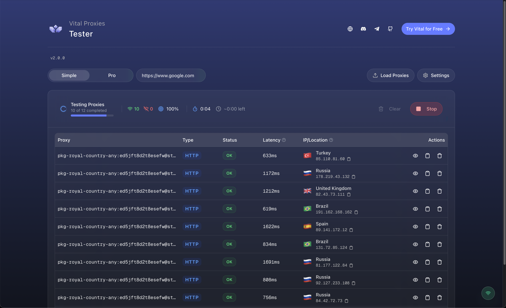

<div align="center">
  
  <h1 align="center">Vital Proxy Tester</h1>
  <p align="center">
    A modern, open-source desktop application for testing and validating proxy lists with real-time results.
    <br />
    <a href="https://github.com/vital-proxies/proxy-tester/releases/latest"><strong>Download Latest Release »</strong></a>
    <br />
    <br />
    <a href="https://github.com/vital-proxies/proxy-tester/issues">Report Bug</a>
    ·
    <a href="https://github.com/vital-proxies/proxy-tester/issues">Request Feature</a>
  </p>
</div>

---



---

## About The Project

The Vital Proxy Tester is a powerful yet simple tool built for anyone who works with proxies. Developed with a modern tech stack (Next.js, Tauri, and Zustand), it provides a fast, beautiful, and intuitive cross-platform experience for testing your proxy lists.

No more slow, clunky, or outdated testing tools. Get instant feedback with a live-streaming results table and detailed analysis for each proxy.

### Key Features

- 🚀 **High-Performance Testing:** Asynchronously tests your proxies to get fast results.
- 🌍 **Comprehensive Data:** For each successful proxy, view Status, Latency (TTFB), IP Address, Country, City, and ISP.
- ✨ **Smart & Interactive UI:**
  - **Auto-Parsing:** Paste your list in almost any common format (`host:port:user:pass`, `user:pass@host:port`, etc.).
  - **Easy Actions:** Copy proxy strings/IPs, view detailed breakdowns, and manage your results with a single click.
- 🔄 **Automatic Updates:** The app notifies you when a new version is available, so you're always up-to-date.
- ✝️ **Cross-Platform:** Works seamlessly on macOS, Windows and Linux.

---

## Getting Started

### Installation

The easiest way to get started is to download the latest official release.

1.  Go to the [**Releases Page**](https://github.com/vital-proxies/proxy-tester/releases/latest).
2.  Download the appropriate installer for your operating system:
    - **macOS:** `Vital.Proxy.Tester.app.tar.gz` (You may need to right-click and "Open" the first time).
    - **Windows:** `Vital.Proxy.Tester_*.msi.zip`
3.  Unzip the file and run the installer.

### Usage

1.  Launch the Vital Proxy Tester application.
2.  Paste your proxy list into the "Paste Proxies" text area on the right.
3.  Configure your test options (e.g., enable IP Lookup).
4.  Click the "Run Test" button.
5.  Watch the results stream into the table in real-time!

---

## Development & Contribution

We welcome contributions from the community! Whether it's a bug fix, a new feature, or a documentation improvement, your help is appreciated.

### Prerequisites

To set up the development environment, you'll need:

- [**Node.js**](https://nodejs.org/) (v20 or higher recommended)
- [**Yarn**](https://yarnpkg.com/)
- [**Tauri Prerequisites**](https://tauri.app/v1/guides/getting-started/prerequisites) for your specific OS.
- [**Rust**](https://www.rust-lang.org/) and Cargo, required by Tauri

### Local Development Setup

1.  **Clone the repository:**

    ```sh
    git clone https://github.com/vital-proxies/proxy-tester.git
    cd proxy-tester
    ```

2.  **Install frontend dependencies:**

    ```sh
    yarn install
    ```

3.  **Run the development server:**
    This will launch the application in a development window with hot-reloading.
    ```sh
    yarn tauri dev
    ```

### How to Contribute

1.  **Fork the Project:** Click the "Fork" button at the top right of this page.
2.  **Create your Feature Branch:**
    ```sh
    git checkout -b feature/AmazingNewFeature
    ```
3.  **Commit your Changes:**
    ```sh
    git commit -m 'feat: Add some AmazingNewFeature'
    ```
4.  **Push to the Branch:**
    ```sh
    git push origin feature/AmazingNewFeature
    ```
5.  **Open a Pull Request:** Go to your fork on GitHub and click "New Pull Request".

Please make sure your code follows the existing style and that you've tested your changes.

---

## Connect with Vital Proxies

The Vital Proxy Tester is proudly developed and maintained by the team at Vital Proxies. We offer premium residential and ISP proxies for all your needs.

- 🌐 **Website:** [vital-proxies.com](https://www.vital-proxies.com/?utm_source=vital-tester&utm_medium=github&utm_campaign=readme)
- 💬 **Discord:** [discord.com/invite/vital-proxies](https://discord.com/invite/vital-proxies)
- ✈️ **Telegram:** [t.me/vitalproxies](https://t.me/vitalproxies)

---

<p align="center">
  <small>Built with ❤️ and the power of open source.</small>
</p>
